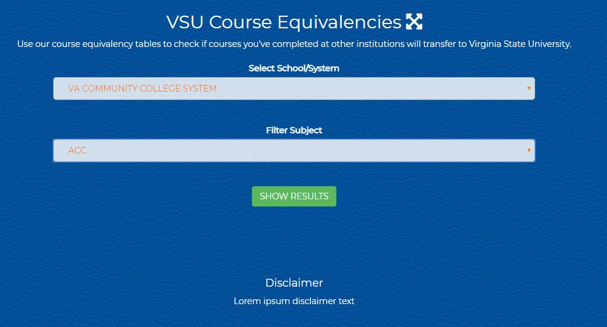

# course-equivalency
> A course equivalency application that is used for prospective students
> for VSU to compare course credits taken from other higher education instituions

**Badges** (placeholder until badges are created)
- AngularJS
- jQuery
- CSS3
- HTML5
- Chrome compatable
- Firefox compatable
- Edge compatable

 

---

## Users
- Prospective Students for VSU
- Project Owner - VSU Admissions
- Public who visits VSU website

## Functions
This web application searches course credit hours from VCCS and converts their course hours into the equivalent within VSU curriculum

---

User first selects school in dropdown menu

User filters courses by subject by subject dropdown menu and clicks 'Show Results' button

User can review and clear results by clicking the 'Hide Results' button

---

## Installation

To have a local install of the working project you would need to have the following:

- xampp
- Sublime text editor
- Download of local files through GitHub desktop app

## Overview

The course equivelancy app was developed to be full production ready application but by default you will see the 'trainingwheels' version which limits searchable schools/systems to VCCS and Richard Bland College.

### Course Eqivelancy Technical Functions
- source data is provided via Elasticsearch API from live Banner data
- app controler grabs a singular static school list through http get .json file which has id fields school code, school name, and school state
- generates searchable school name dropdown by selected state
  - Angular in HTML dynamically filters and sorts the dropdown menu of school/system based on the state selection entered by user.*
- Once school is selected, we use the same method of filtering and sorting based on course subject.  
- based on selected school name, app factory gets individual school course .json by school code from API
- Toggle fullview is handled by JS for cross-platform compatibility
- Hiding and showing results is handled by jQuery

* *This functionality is **not** enabled by default and is labeled 'bugatti' in order to be separate from default view, 'trainingwheels'. 'trainingwheels' School selection is defaulted to VCCS and Richard Bland College, as of this version.*

---
